# CEC-codex 前端 + 后端架构详细图

生成位置：`/Volumes/Install macOS Sequoia/CEC-codex/架构详细图`

> 本图基于当前仓库代码扫描生成，重点覆盖截图中的应用侧边栏、React 前端骨架、FastAPI 后端路由、启动服务、交易所数据采集、数据库模型、AI/Program/Signal/回测链路。它是代码架构说明，不是产品宣传页。
>
> **2026-07-04 深度校验更新**（分支 `refactor/code-split`，含未提交改动）：逐一核对了 `main.py` 全部 34 处 `include_router`、前端全部 hash 页面与懒加载组件、调度任务真实周期、双库读写归属，并新增「事件合约纸面交易与滚动验证」深度章节。本次核实的关键事实：AI Stream 是缓冲长轮询而非原生 SSE；快照库只有 Hyperliquid 子系统写入；`backend/app_routers.py` 是拆分残留（main.py 未调用）；设置页 `BinanceDataSettingsTab` 已删除并并入共用的 `ExchangeDataSettingsTab`。

## 0. 代码依据

- 前端入口：`frontend/app/main.tsx`、`AppProviders.tsx`、`AppShell.tsx`、`components/layout/Sidebar.tsx`、`hooks/useHashRoute.ts`。
- 前端 API 层：`frontend/app/lib/apiClient.ts` 与 `frontend/app/lib/api.ts` barrel export。
- 数据采集页面：`frontend/app/components/settings/SettingsPage.tsx`、`settings-page/ExchangeDataSettingsTab.tsx`、`DataCoverageHeatmap.tsx`、`settings-page/constants.ts`。
- 后端入口：`backend/main.py`，集中注册所有 API routers，并挂载静态前端。
- 后端启动：`backend/app_startup.py` 负责数据库/迁移/seed/服务初始化前置工作，`backend/services/startup.py` 负责 scheduler、collector、strategy、bot 等运行服务。
- 后端路由拆分：`backend/api/*`、`backend/api/binance_routes/*`、`backend/api/hibt_routes/*`、`backend/api/system/*`、`backend/routes/program_routes.py`。
- 数据模型拆分：`backend/database/models/*.py`，主库通过 `database.connection.SessionLocal`，快照库通过 `snapshot_connection`。

## 1. 全局系统拓扑图

```mermaid
flowchart LR
  User["操作者 / 研究员<br/>浏览器 UI"] --> Browser["Browser<br/>React + Hash Route"]
  Browser -->|开发环境 http://127.0.0.1:8802| Vite["Vite Dev Server<br/>frontend/vite.config.ts<br/>proxy /api + /ws"]
  Browser -->|生产环境同源访问| Static["FastAPI Static<br/>backend/static<br/>/static 与 /assets"]
  Vite -->|/api 与 /ws 代理| FastAPI["FastAPI app<br/>backend/main.py<br/>uvicorn :5611"]
  Static --> FastAPI
  Browser -->|fetch /api/*| FastAPI
  Browser -->|长轮询 /api/ai-stream/{task_id}?offset=| AIStream["AI Stream Service<br/>api/ai_stream_routes.py<br/>services/ai_stream_service.py<br/>缓冲轮询而非原生 SSE"]
  Browser -->|WebSocket /ws| WS["WebSocket Manager<br/>api/ws/*"]

  FastAPI --> Startup["启动层<br/>backend/app_startup.py<br/>services/startup.py"]
  Startup --> Scheduler["APScheduler 包装<br/>services/scheduler.py"]
  Startup --> Collectors["行情采集器<br/>Kline / Market Flow / Binance / HiBT"]
  Startup --> Strategy["交易策略与自动交易<br/>services/trading_strategy.py"]
  Startup --> RuntimeMonitor["运行时监控<br/>backend/app_runtime.py"]

  FastAPI --> MainDB[("PostgreSQL 主库<br/>SQLAlchemy SessionLocal")]
  FastAPI --> SnapshotDB[("Snapshot DB<br/>snapshot_connection<br/>snapshot_models")]
  Scheduler --> MainDB
  Collectors --> MainDB
  Strategy --> MainDB
  AIStream --> MainDB
  WS --> Browser

  Collectors --> BinanceAPI["Binance Futures APIs<br/>REST + WebSocket"]
  Collectors --> HiBTAPI["HiBT Public APIs<br/>REST Kline + Deals"]
  Collectors --> HyperAPI["Hyperliquid APIs<br/>Market + Account"]
  FastAPI --> CoinGlassAPI["CoinGlass APIs<br/>server-side paid keys"]
  FastAPI --> LLM["LLM Providers<br/>OpenAI-compatible / Anthropic / others"]
  FastAPI --> Bots["Telegram / Discord Bot Adapter"]

  classDef client fill:#e0f2fe,stroke:#0284c7,color:#0f172a
  classDef backend fill:#ede9fe,stroke:#7c3aed,color:#0f172a
  classDef data fill:#dcfce7,stroke:#16a34a,color:#0f172a
  classDef external fill:#ffedd5,stroke:#ea580c,color:#0f172a
  class User,Browser,Vite,Static client
  class FastAPI,Startup,Scheduler,Collectors,Strategy,RuntimeMonitor,AIStream,WS backend
  class MainDB,SnapshotDB data
  class BinanceAPI,HiBTAPI,HyperAPI,CoinGlassAPI,LLM,Bots external
```

## 2. 前端 Shell、侧边栏与页面架构

截图中左侧导航来自 `frontend/app/components/layout/Sidebar.tsx`，当前选中的“归因分析”对应 hash page `attribution`，渲染 `components/analytics/AttributionAnalysis`。

```mermaid
flowchart TB
  Main["frontend/app/main.tsx<br/>应用初始化"] --> Providers["AppProviders.tsx<br/>AuthProvider<br/>ExchangeProvider<br/>TradingModeProvider<br/>ArenaDataProvider<br/>Toaster"]
  Main --> Route["useHashRoute.ts<br/>hash 路由<br/>默认 hyper-ai"]
  Main --> AuthGate["登录与初始化门控<br/>AuthContext + isAuthenticated<br/>SplashScreen + Hyper AI Onboarding"]
  Providers --> AppShell["AppShell.tsx<br/>Header + Sidebar + MainContent"]
  Route --> AppShell
  AuthGate --> AppShell

  AppShell --> Sidebar["components/layout/Sidebar.tsx<br/>截图左侧导航来源"]
  AppShell --> Header["components/layout/Header.tsx<br/>页面标题 / 账户选择"]
  AppShell --> MainContent["MainContent<br/>lazy-loaded page views"]

  Sidebar --> NavHyper["Hyper AI<br/>page=hyper-ai"]
  Sidebar --> NavDash["数据看板<br/>page=comprehensive"]
  Sidebar --> NavAITrader["AI交易员<br/>page=trader-management"]
  Sidebar --> NavPrompt["提示词策略<br/>page=prompt-management"]
  Sidebar --> NavProgram["程序化交易<br/>page=program-trader"]
  Sidebar --> NavSignal["信号系统<br/>page=signal-management"]
  Sidebar --> NavAttribution["归因分析<br/>page=attribution<br/>截图选中项"]
  Sidebar --> NavBacktest["回测工具<br/>page=backtest-tool"]
  Sidebar --> NavFactor["因子库<br/>page=factor-library"]
  Sidebar --> NavManual["手动交易<br/>page=manual-trading"]
  Sidebar --> NavKline["K线图表<br/>page=klines"]
  Sidebar --> NavCG["CoinGlass<br/>page=coinglass"]
  Sidebar --> NavLogs["系统日志<br/>page=system-logs"]
  Sidebar --> SettingsGear["设置入口<br/>page=settings"]

  MainContent --> HyperAiPage["components/hyper-ai/HyperAiPage"]
  MainContent --> Dashboard["components/portfolio/ComprehensiveView<br/>paper 模式数据看板"]
  MainContent --> HyperView["components/hyperliquid/HyperliquidView<br/>live/testnet 桌面视图"]
  MainContent --> MobileDashboard["components/mobile/MobileDashboard<br/>移动端看板"]
  MainContent --> TraderMgmt["components/trader/TraderManagement"]
  MainContent --> PromptManager["components/prompt/PromptManager"]
  MainContent --> ProgramTrader["components/program/ProgramTrader"]
  MainContent --> SignalManager["components/signal/SignalManager"]
  MainContent --> Attribution["components/analytics/AttributionAnalysis"]
  MainContent --> Backtest["components/backtest/BacktestTool"]
  MainContent --> FactorLib["components/factor/FactorLibrary"]
  MainContent --> ManualTrading["components/hyperliquid/HyperliquidPage"]
  MainContent --> Klines["components/klines/KlinesView"]
  MainContent --> CoinGlass["components/coinglass/CoinGlassView"]
  MainContent --> Settings["components/settings/SettingsPage"]
  MainContent --> Logs["components/layout/SystemLogs"]

  classDef shell fill:#dbeafe,stroke:#2563eb,color:#0f172a
  classDef nav fill:#fef3c7,stroke:#d97706,color:#0f172a
  classDef page fill:#dcfce7,stroke:#16a34a,color:#0f172a
  class Main,Providers,Route,AuthGate,AppShell,Sidebar,Header,MainContent shell
  class NavHyper,NavDash,NavAITrader,NavPrompt,NavProgram,NavSignal,NavAttribution,NavBacktest,NavFactor,NavManual,NavKline,NavCG,NavLogs,SettingsGear nav
  class HyperAiPage,Dashboard,HyperView,MobileDashboard,TraderMgmt,PromptManager,ProgramTrader,SignalManager,Attribution,Backtest,FactorLib,ManualTrading,Klines,CoinGlass,Settings,Logs page
```

### 2.1 侧边栏之外的页面与移动端形态

| 入口 | hash page | 组件 | 说明 |
|---|---|---|---|
| 移动端底栏 Model Chat | `model-chat` | `components/mobile/MobileModelChat.tsx` | 仅移动端底栏（Sidebar.tsx 底栏：Dashboard / K线 / Model Chat / Program） |
| 移动端 Program | `program-trader` | `components/mobile/MobilePrograms.tsx` | 同一 hash，桌面渲染 `program/ProgramTrader` |
| Arena 资产页 | `arena-assets` | `components/arena/ArenaAssets.tsx` | 无导航入口，只能 hash 直达 |
| 登录页 | 路径 `/login`（非 hash） | `components/auth/LoginPage.tsx` | `authEnabled && !authUser` 时全局兜底 |
| 旧链接兼容 | `hyperliquid` → `manual-trading` | `hooks/useHashRoute.ts` | 路由层做别名归一化，并剥离 hash 内 `?query` |

启动门控顺序（`main.tsx`）：`/login` 路径 → 全局认证门（`authEnabled && !authUser`）→ `SplashScreen`（等动画 + `isDataReady`）→ Hyper AI Onboarding（`/api/hyper-ai/profile` 返回 `!llm_configured` 时）→ `AppShell`。桌面/移动分支用 Tailwind `md:hidden` / `hidden md:flex` 切换；所有页面组件在 `AppShell.tsx` 中 `React.lazy` + `Suspense` 懒加载（仅 `AuthorizationModal`、`AgentWalletUpgradeModal` 保持同步加载）。

## 3. 前端状态层与 API 调用层

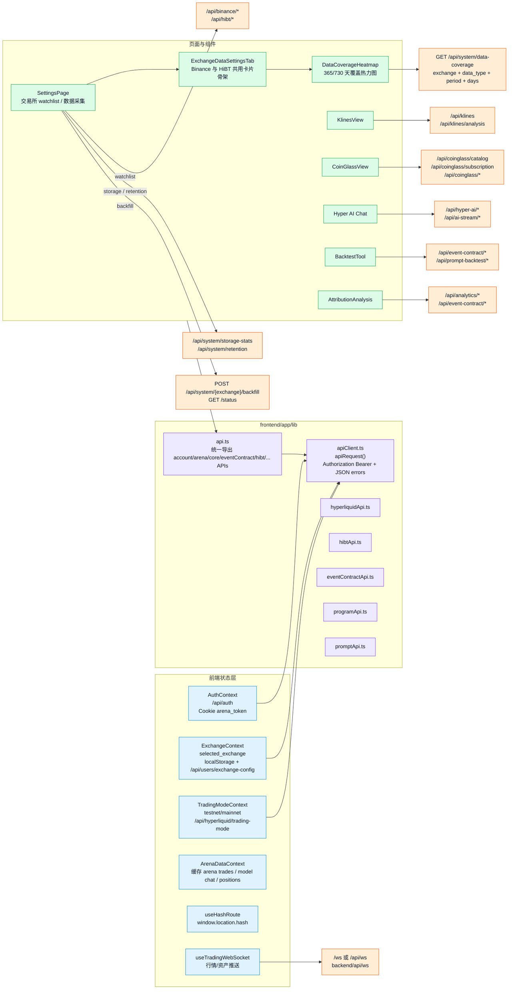

### 3.1 前端模块表

| 层级 | 关键文件/目录 | 责任 |
|---|---|---|
| 应用入口 | `frontend/app/main.tsx` | 初始化 i18n/CSS/providers，处理登录态、Splash、Hyper AI onboarding、账户与资产状态 |
| Provider | `frontend/app/AppProviders.tsx` | 组合 Auth、Exchange、TradingMode、ArenaData 等上下文 |
| Shell | `frontend/app/AppShell.tsx` | Header + Sidebar + MainContent，所有页面 lazy import，降低首屏包大小 |
| 导航 | `frontend/app/components/layout/Sidebar.tsx` | 截图左侧菜单来源，负责桌面/移动导航、交易模式切换、交易所入口 |
| 路由 | `frontend/app/hooks/useHashRoute.ts` | hash route，`#attribution` 等页面可分享，默认 `hyper-ai` |
| API 基础 | `frontend/app/lib/apiClient.ts` | `/api` 前缀、Cookie token、Bearer Authorization、统一错误解析、timeout |
| API 聚合 | `frontend/app/lib/api.ts` | 导出 account、arena、core、eventContract、hibt、program、prompt、traderData 等 API |
| 设置页 | `frontend/app/components/settings/SettingsPage.tsx` | 交易所 watchlist、storage stats、retention、backfill 状态轮询、语言切换 |
| 数据采集卡片 | `settings-page/ExchangeDataSettingsTab.tsx` | Binance/HiBT 复用同一套完整卡片布局和覆盖热力图骨架 |
| 覆盖热力图 | `components/settings/DataCoverageHeatmap.tsx` | 调 `/api/system/data-coverage`，显示 symbol tabs、days selector、legend、summary、365/730 天格子 |
| 页面视图 | `components/hyper-ai`, `portfolio`, `trader`, `prompt`, `program`, `signal`, `analytics`, `backtest`, `factor`, `klines`, `coinglass` | 对应截图菜单与核心业务页面 |
| 国际化 | `frontend/app/locales/en.json`, `zh.json`, `i18n.ts` | 中英文文案、浏览器语言检测、localStorage 缓存（key `arena-language`，fallback en） |

### 3.2 实时通道协议（深度校验）

- **WebSocket**：`hooks/useTradingWebSocket.ts` 是**进程级单例**（`wsSingleton`）。URL 依次取 `VITE_WS_URL` → 开发态 `ws://<host>:5611/ws` → 同源 `/ws`。JSON 协议：出站 `bootstrap` / `get_snapshot` / `get_asset_curve` / `place_order` / `switch_user` / `switch_account`；入站 `bootstrap_ok`、`snapshot`、`trades`、`order_filled`/`order_pending`、`trade_update`、`position_update`、`model_chat_update`、`asset_curve_update`/`asset_curve_data`、`error`。异常断开 3 秒自动重连，另有 5 分钟兜底快照刷新。
- **实时交易数据不放 Context**：positions/orders/trades/aiDecisions 等状态保存在 `main.tsx` 顶层 state（由 WS 填充）并向下传 props；四个 Context（Auth/Exchange/TradingMode/ArenaData）只承载认证、交易所选择、testnet/mainnet 模式与 Arena 缓存。
- **AI 流式输出**：`lib/pollAiStream.ts` 对 `/api/ai-stream/<taskId>?offset=` 做长轮询分块拉取（并非 EventSource）。后端由 `services/ai_stream_service.py` 的 buffer manager 支撑。消费方遍布所有 AI 界面：Hyper AI 页（`page-parts/hyperAiTaskStream.ts`）、归因 AI 聊天、交易回放 AI、Program/Prompt/Signal AI 聊天、NewsZone、DashboardInsightView。真正的 `StreamingResponse` 只出现在 `analytics_routes.py`、`market_intelligence_routes.py`、`prompts/ai_chat_routes.py`、`signal_routes/ai_chat.py`。
- **API barrel**：`lib/api.ts` 仅 13 行，重导出 `apiClient` + 12 个域模块（account/arena/builderAuthorization/core/eventContract/hibt/marketConfig/marketInsight/program/prompt/promptBacktest/traderData）；Hyperliquid 系列（`hyperliquidApi/AccountApi/WalletApi/WalletSetup`）、`binanceFuturesApi`、`auth` 等不走 barrel，直接 import。最大的 API 模块是 `eventContractApi.ts`（约 900 行）。

## 4. 后端 FastAPI Router 架构

```mermaid
flowchart TB
  Main["backend/main.py<br/>FastAPI app"] --> Middleware["CORS + GZip<br/>StaticFiles /static /assets"]
  Main --> StartupHooks["startup/shutdown hooks<br/>app_startup + service shutdown"]
  Main --> Health["GET /api/health<br/>POST /api/rebuild-frontend"]

  Main --> Auth["/api/auth<br/>local_auth_routes.py"]
  Main --> User["/api/users<br/>user_routes.py"]
  Main --> Accounts["/api/account<br/>account_routes.py"]
  Main --> Orders["/api/orders<br/>order_routes.py"]
  Main --> Crypto["/api/crypto<br/>crypto_routes.py"]
  Main --> Market["/api/market<br/>market_data_routes.py"]
  Main --> Ranking["/api/ranking<br/>ranking_routes.py"]
  Main --> Arena["/api/arena<br/>arena_routes.py"]
  Main --> Config["/api/config<br/>config_routes.py"]
  Main --> Sampling["/api/sampling<br/>sampling_routes.py"]
  Main --> MarketRegime["/api/market-regime<br/>market_regime_routes.py"]
  Main --> TraderData["/api/trader<br/>trader_data_routes.py + api/trader_data/*"]
  Main --> PromptBacktest["/api/prompt-backtest<br/>prompt_backtest_routes.py"]

  Main --> HyperLiquid["/api/hyperliquid<br/>hyperliquid_routes.py"]
  Main --> HyperActions["/api/hyperliquid/actions<br/>hyperliquid_action_routes.py"]
  Main --> Binance["/api/binance<br/>wallet / trading / account / market"]
  Main --> HiBT["/api/hibt<br/>wallet / trading / account / market"]

  Main --> Klines["/api/klines<br/>kline_routes.py + kline_analysis_routes.py"]
  Main --> MarketFlow["/api/market-flow<br/>summary + indicators"]
  Main --> System["/api/system<br/>storage_stats + coverage + retention + backfill"]
  Main --> CoinGlass["/api/coinglass<br/>catalog + keys + event_contract client"]

  Main --> HyperAI["/api/hyper-ai<br/>profile + conversation + memory + skills + tools"]
  Main --> AIStream["/api/ai-stream<br/>SSE task polling"]
  Main --> Prompts["/api/prompts<br/>templates + bindings + preview + AI chat + variables"]
  Main --> Program["/api/programs<br/>legacy program routes"]
  Main --> Signals["/api/signals<br/>definitions + pools + analysis + testing + trigger logs"]
  Main --> Factors["/api/factors<br/>library + values + effectiveness + compute + custom + expression"]
  Main --> Analytics["/api/analytics<br/>analytics_routes.py"]
  Main --> EventContract["/api/event-contract<br/>event_contract_routes.py"]
  Main --> News["/api/news<br/>news_routes.py"]
  Main --> Intel["/api/market-intelligence<br/>market_intelligence_routes.py"]
  Main --> Logs["/api/system-logs<br/>system_log_routes.py"]
  Main --> Bots["/api/bot<br/>telegram + discord + notifications"]

  System --> StorageStats["GET storage-stats?exchange="]
  System --> Coverage["GET data-coverage?exchange=&data_type=&period=&days="]
  System --> Retention["GET/PUT retention-days"]
  System --> Backfill["POST /{exchange}/backfill<br/>GET /{exchange}/backfill/status"]

  classDef root fill:#dbeafe,stroke:#2563eb,color:#0f172a
  classDef route fill:#ede9fe,stroke:#7c3aed,color:#0f172a
  classDef system fill:#fef3c7,stroke:#d97706,color:#0f172a
  class Main,Middleware,StartupHooks,Health root
  class Auth,User,Accounts,Orders,Crypto,Market,Ranking,Arena,Config,Sampling,MarketRegime,TraderData,PromptBacktest,HyperLiquid,HyperActions,Binance,HiBT,Klines,MarketFlow,CoinGlass,HyperAI,AIStream,Prompts,Program,Signals,Factors,Analytics,EventContract,News,Intel,Logs,Bots route
  class System,StorageStats,Coverage,Retention,Backfill system
```

### 4.1 API Route Map

| 前缀 | Router/包 | 主要用途 |
|---|---|---|
| `/api/health` | `backend/main.py` | 健康检查与版本 |
| `/api/auth` | `local_auth_routes.py` | 本地登录、注册、token/session |
| `/api/users` | `user_routes.py` | 用户配置、交易所选择 |
| `/api/account` | `account_routes.py` | 账户、资产、AI 交易触发 |
| `/api/orders` | `order_routes.py` | 订单查询与操作 |
| `/api/market` | `market_data_routes.py` | 行情数据 |
| `/api/config` | `config_routes.py` | 全局/系统配置 |
| `/api/sampling` | `sampling_routes.py` | 采样池与采样间隔配置 |
| `/api/market-regime` | `market_regime_routes.py` | 市场状态（regime）配置与查询 |
| `/api/trader` | `trader_data_routes.py` + `api/trader_data/*` | 交易员数据导入/导出 |
| `/api/prompt-backtest` | `prompt_backtest_routes.py` | Prompt 回测任务 |
| `/api/klines` | `kline_routes.py`, `kline_analysis_routes.py` | K线与 K线分析（两个 router 共用前缀） |
| `/api/market-flow` | `market_flow_routes/*` | CVD、taker buy/sell、OI、funding、depth ratio、large zones |
| `/api/system` | `api/system/*` | 存储统计、覆盖率、保留期、历史回填 |
| `/api/binance` | `api/binance_routes/*` | Binance 钱包、账户、交易、市场/监听币种 |
| `/api/hibt` | `api/hibt_routes/*` | HiBT 钱包、账户、交易、市场/监听币种 |
| `/api/hyperliquid` | `hyperliquid_routes.py` | Hyperliquid 账户、环境、交易相关 |
| `/api/hyperliquid/actions` | `hyperliquid_action_routes.py` | Hyperliquid action 记录/执行辅助 |
| `/api/hyper-ai` | `hyper_ai_routes.py`, `api/hyper_ai/*` | Hyper AI profile、chat、memory、skills、tools |
| `/api/ai-stream` | `ai_stream_routes.py` | SSE/background AI task |
| `/api/prompts` | `prompt_routes.py`, `api/prompts/*` | Prompt 模板、绑定、预览、AI chat、变量说明 |
| `/api/programs` | `routes/program_routes.py` | Program Trader |
| `/api/signals` | `api/signal_routes/*` | 信号定义、池、回测/测试、触发日志、AI chat |
| `/api/factors` | `api/factor_routes/*` | 因子库、值、有效性、计算、自定义表达式 |
| `/api/analytics` | `analytics_routes.py` | 分析/归因数据入口 |
| `/api/event-contract` | `event_contract_routes.py` | 事件合约回测/纸面交易/验证 |
| `/api/coinglass` | `coinglass_routes.py`, `api/coinglass/*` | CoinGlass catalog、subscription/key、付费接口代理 |
| `/api/news` | `news_routes.py` | 新闻源与新闻情报 |
| `/api/market-intelligence` | `market_intelligence_routes.py` | 市场情报聚合 |
| `/api/bot` | `api/bot_routes/*` | Telegram/Discord bot 配置与通知 |
| `/api/system-logs` | `system_log_routes.py` | 系统日志 UI 数据 |
| `/ws` | `api/ws/*`（endpoint/manager/broadcast/snapshots） | WebSocket 单入口，`ConnectionManager` 按账户维护连接集合并注册 10s 快照任务 |

### 4.2 拆分包的组织模式与两处入口级事实

- **拆分包模式**：`binance_routes` / `hibt_routes` / `system` / `signal_routes` / `factor_routes` / `bot_routes` / `market_flow_routes` / `prompts` / `coinglass` 等包都采用同一手法——在 `_shared.py` / `_base.py` / `base.py` / `_router.py` 定义共享 `router`，`__init__.py` 导入各子模块靠装饰器副作用挂路由。唯一例外是 `api/hyper_ai_routes.py`，它用嵌套 `router.include_router()` 聚合 `api/hyper_ai/` 的 profile/conversation/memory/skill/tool 子路由。
- **`backend/app_routers.py` 是拆分残留**：其中有一份与 `main.py` 顺序一致的 `register_routers(app)`，但 `main.py` 目前仍在内联 `include_router`，并未调用它。二者以后必须二选一，否则改路由时容易漏改。
- **main.py 直挂的零散端点**：`/api/health`、`POST /api/rebuild-frontend`、`/api/accounts/{id}/strategy` 别名（GET/PUT，转发到 `account_routes`）、`/api/strategy/status`。经过代码拆分，`main.py` 目前仅约 350 行。

## 5. 后端服务、调度任务与后台采集器

```mermaid
flowchart TB
  AppStartup["app_startup.run_startup_tasks"] --> DBCreate["Base.metadata.create_all"]
  AppStartup --> SnapshotInit["init_snapshot_database"]
  AppStartup --> Migrations["migration_manager.run_all_migrations<br/>idempotent migrations"]
  AppStartup --> Schema["schema_validator.validate_and_sync_schema"]
  AppStartup --> Seed["seed core DB<br/>default user / trading configs / prompts"]
  AppStartup --> CleanupTasks["cleanup leftover backfill tasks"]
  AppStartup --> InitServices["services.startup.initialize_services"]

  InitServices --> Scheduler["start_scheduler + setup_market_tasks"]
  InitServices --> Symbols["symbol catalogs<br/>Hyperliquid + Binance + HiBT refresh"]
  InitServices --> MarketStream["market_stream<br/>polling by GlobalSamplingConfig"]
  InitServices --> StrategyMgr["trading_strategy.StrategyManager<br/>AI / random auto trade hooks"]
  InitServices --> ProgramExec["program_execution_service<br/>on_price_update triggers"]
  InitServices --> Snapshots["account snapshot services<br/>Hyperliquid 30s<br/>Binance 5min"]
  InitServices --> RealtimeKlines["kline_realtime_collector<br/>1m interval"]
  InitServices --> HLMarketFlow["market_flow_collector<br/>Hyperliquid trades/orderbook/OI/funding"]
  InitServices --> BinanceRest["exchanges.binance_collector<br/>REST polling"]
  InitServices --> BinanceWS["exchanges.binance_ws_collector<br/>15s taker volume aggregation"]
  InitServices --> HiBTCollector["exchanges.hibt_collector<br/>REST deals polling"]
  InitServices --> FactorEngine["factor_computation_service<br/>factor_effectiveness_service"]
  InitServices --> NewsCollector["news_collector_service<br/>news_ai_classifier"]
  InitServices --> EventLive["event_contract.live_paper_trader<br/>60s cycle"]
  InitServices --> EventValidation["event_contract.rolling_validation<br/>12h validation"]
  InitServices --> Bots["Telegram / Discord restore"]

  Scheduler --> Jobs["interval jobs<br/>price_cache_cleanup<br/>asset_curve_broadcast<br/>market_flow_cleanup<br/>news_collector<br/>news_ai_classifier<br/>event paper trader<br/>rolling validation"]
  MarketStream --> PriceEvents["market_events pub/sub"]
  PriceEvents --> StrategyMgr
  PriceEvents --> ProgramExec
  PriceEvents --> AssetSnapshot["asset_snapshot_service<br/>disabled paper snapshot handler noted"]

  HLMarketFlow --> Persistence["data_persistence / market_flow tables"]
  BinanceRest --> Persistence
  BinanceWS --> Persistence
  HiBTCollector --> Persistence
  RealtimeKlines --> KlineStore["crypto_klines"]
  FactorEngine --> FactorStore["factor_values<br/>factor_effectiveness"]
  EventLive --> EventStore["event_contract_* tables"]
  NewsCollector --> NewsStore["news_articles"]
  StrategyMgr --> TradeStore["orders / trades / positions / ai_decision_logs"]

  Persistence --> MainDB[("PostgreSQL 主库")]
  KlineStore --> MainDB
  FactorStore --> MainDB
  EventStore --> MainDB
  NewsStore --> MainDB
  TradeStore --> MainDB

  classDef startup fill:#dbeafe,stroke:#2563eb,color:#0f172a
  classDef service fill:#ede9fe,stroke:#7c3aed,color:#0f172a
  classDef job fill:#fef3c7,stroke:#d97706,color:#0f172a
  classDef data fill:#dcfce7,stroke:#16a34a,color:#0f172a
  class AppStartup,DBCreate,SnapshotInit,Migrations,Schema,Seed,CleanupTasks,InitServices startup
  class Scheduler,Symbols,MarketStream,StrategyMgr,ProgramExec,Snapshots,RealtimeKlines,HLMarketFlow,BinanceRest,BinanceWS,HiBTCollector,FactorEngine,NewsCollector,EventLive,EventValidation,Bots,PriceEvents,AssetSnapshot service
  class Jobs job
  class Persistence,KlineStore,FactorStore,EventStore,NewsStore,TradeStore,MainDB data
```

### 5.1 后端模块表

| 层级 | 关键文件/目录 | 责任 |
|---|---|---|
| FastAPI 入口 | `backend/main.py` | 创建 app、health、CORS/GZip、静态资源、startup/shutdown、注册 routers |
| 启动前置 | `backend/app_startup.py` | 创建表、初始化 snapshot DB、运行迁移、校验 schema、seed、清理遗留任务、初始化服务 |
| 服务启动 | `backend/services/startup.py` | APScheduler、行情流、策略、Program Trader、快照、K线/资金流 collector、factor/news/event/bot 启动与关闭 |
| 系统 API | `backend/api/system/*` | storage stats、data coverage、retention、backfill start/status |
| 交易所 API | `backend/api/binance_routes/*`, `backend/api/hibt_routes/*`, `hyperliquid_routes.py` | 钱包绑定、账户/持仓、手动下单、市场/监听币种 |
| 市场数据 API | `kline_routes.py`, `kline_analysis_routes.py`, `market_flow_routes/*`, `market_data_routes.py` | K线、技术分析、资金流指标、行情查询 |
| AI/Prompt | `hyper_ai_routes.py`, `api/hyper_ai/*`, `prompt_routes.py`, `ai_stream_routes.py` | Hyper AI profile/chat/memory/tools/skills，Prompt templates/preview，SSE task stream |
| Program Trader | `routes/program_routes.py`, `backend/program_trader/*`, `services/program_execution_service.py` | 代码校验、沙箱执行、回测、价格触发执行 |
| Signal/Factor | `api/signal_routes/*`, `api/factor_routes/*`, `services/factor_*` | 信号池/触发日志、因子库/计算/有效性、自定义表达式 |
| Event Contract | `api/event_contract_routes.py`, `services/event_contract/*` | 事件合约回测、纸面交易、滚动验证、CoinGlass 因子 |
| Bot | `api/bot_routes/*`, `telegram_bot_service.py`, `discord_bot_service.py` | Bot 配置、Webhook/Gateway、消息推送与适配器 |
| 数据模型 | `backend/database/models/*.py` | 用户/账户/交易、市场数据、交易所钱包、AI 会话、Prompt、Program、Signal、Factor、Event tables |

### 5.2 调度任务实测周期（来自 `services/startup.py` / `scheduler.py`）

| 任务 | 周期 | 来源 |
|---|---|---|
| 行情流轮询 `market_stream` | `GlobalSamplingConfig.sampling_interval`，默认 18s（下限 5s） | `market_stream.py` |
| 账户快照（每账户 `snapshot_account_{id}`） | 10s | `scheduler.py` |
| Hyperliquid 账户快照服务 | 30s（async） | `hyperliquid_snapshot_service.py` |
| Binance 账户快照服务 | 300s（async） | `binance_snapshot_service.py` |
| K线实时采集 `kline_realtime_collector` | 60s（async） | startup |
| 资金流采集聚合 | 15s（Binance WS taker volume 同为 15s 聚合） | `market_flow_collector/` |
| `market_flow_data_cleanup` | 6h（保留 30 天） | `market_flow_collector/maintenance.py` |
| `price_cache_cleanup` | 120s | startup |
| `asset_curve_broadcast`（WS 推 5m/1h/1d 资产曲线） | 60s | `scheduler.py` |
| `news_collector` / `news_ai_classifier` | 60s（各源自带间隔）/ 30min | startup |
| 因子计算 + 有效性评估 | 由 `FACTOR_ENGINE_ENABLED` 开关控制 | `factor_computation_service.py` |
| **`event_paper_trader`（事件合约纸面交易循环）** | **60s** | `event_contract/live_paper_trader.py` |
| **`event_rolling_validation_cycle`（滚动样本外验证）** | **12h** | `event_contract/rolling_validation.py` |

### 5.3 双库读写归属（深度校验结论）

- **快照库（`SNAPSHOT_DATABASE_URL`，`snapshot_models.py` 只有两张表）：只有 Hyperliquid 子系统写入** —— `HyperliquidAccountSnapshot`、`HyperliquidTrade`（均带 testnet/mainnet `environment` 列）。写入方：`hyperliquid_snapshot_service.py`、`trading_commands/hyperliquid_execution.py`、`asset_curve_calculator.py`、`program_execution_logging.py`；读取方：analytics/arena/hyperliquid/trader_data 路由与 `ai_attribution_service/tools.py`。
- **主库承载其余一切**：accounts/orders/trades、`crypto_klines`、market flow 三表、factor/signal、event contract 全部表、Hyper AI 会话、news、program——包括 **Binance 与 HiBT 的账户快照**（`BinanceAccountSnapshot` 等在 `database/models/`，不在快照库）。
- 迁移机制：`migration_manager.py` **没有迁移记录表**，每次启动全量执行 `MIGRATIONS` 列表（约 80 个幂等脚本），失败不阻塞启动；另有 `app_startup.py` 内联的 `ALTER TABLE` 列补齐。

## 6. Binance / HiBT 数据采集、回填与覆盖热力图

这一块对应你前面要求的：**保留 Binance 完整卡片布局与覆盖热力图，并让 HiBT 页也使用同一套展示骨架**。前端统一由 `ExchangeDataSettingsTab` 输出完整卡片，热力图由 `DataCoverageHeatmap` 请求 `/api/system/data-coverage`。

当前分支上 `settings-page/BinanceDataSettingsTab.tsx` **已删除**，Binance 与 HiBT 完全共用 `ExchangeDataSettingsTab`。`SettingsPage.tsx` 目前是四个 Tab：**Watchlist / Binance-Data / HiBT-Data / News-Sources**（新闻源 Tab 由 `NewsSourcesSettingsTab` + `useNewsSourcesSettings` 支撑）。

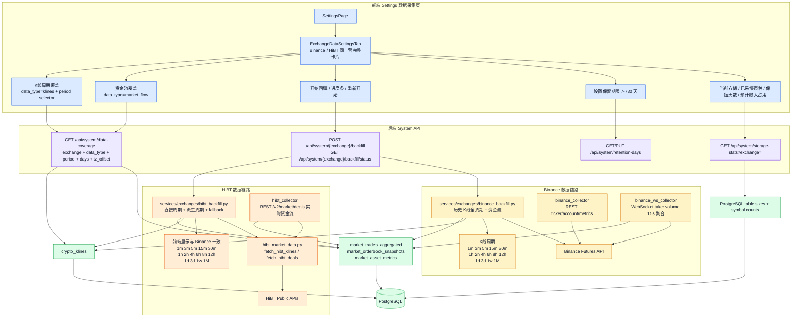

### 6.1 数据覆盖口径

| 数据类型 | Binance | HiBT | 前端展示 |
|---|---|---|---|
| 资金流覆盖 | Binance WebSocket/REST taker volume 与历史回填写入 `market_trades_aggregated` | HiBT `deals` 实时采集；历史 1m K线可生成 proxy/fallback 资金流覆盖 | `DataCoverageHeatmap exchange=... dataType=market_flow` |
| K线覆盖 | Binance 全周期：`1m, 3m, 5m, 15m, 30m, 1h, 2h, 4h, 6h, 8h, 12h, 1d, 3d, 1w, 1M` | HiBT 页面同样展示 Binance 完整周期；后端直接周期 + 派生周期补齐 | `periodOptions={BINANCE_KLINE_PERIODS}`，默认 `1m` |
| 存储统计 | 统计 exchange 维度表大小、币种数、保留天数 | 同一接口同一卡片骨架 | `/api/system/storage-stats?exchange=` |
| 保留期 | 7-730 天 | 7-730 天 | `/api/system/retention-days` |
| 回填任务 | `BinanceBackfillTask` | `HibtBackfillTask` | `/api/system/{exchange}/backfill/status` 轮询进度 |

### 6.2 Settings 回填时序图

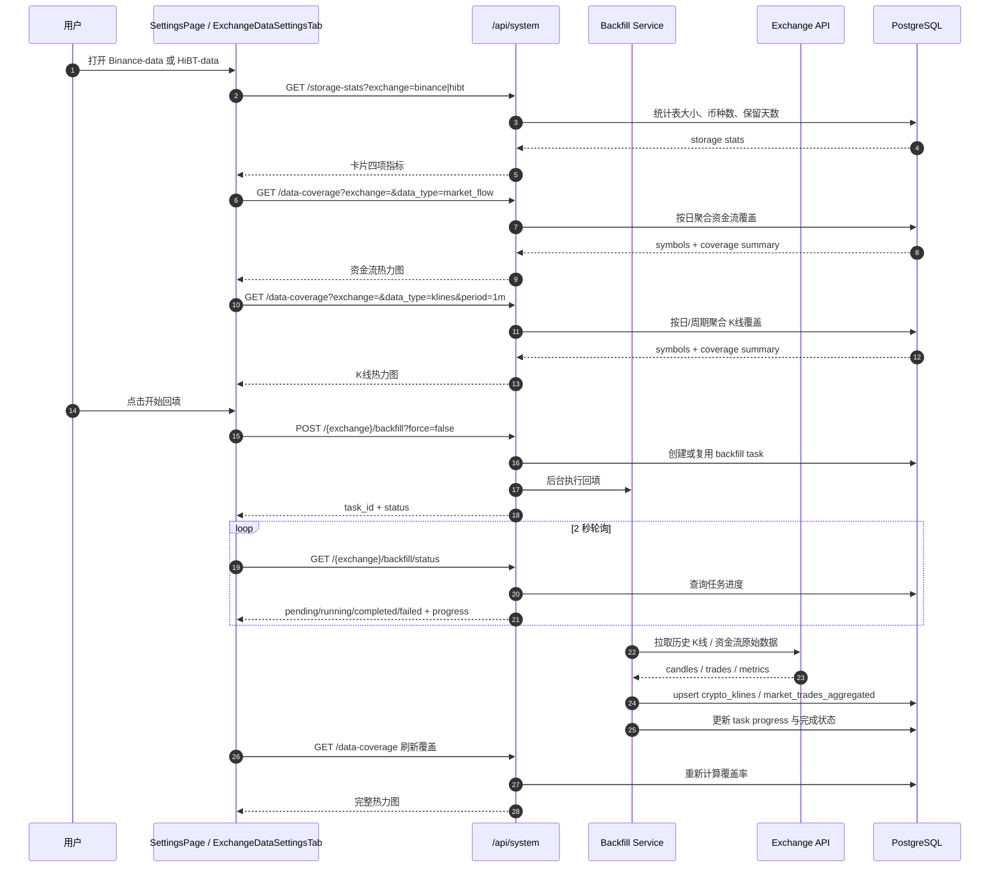

## 7. AI 交易员、Program Trader、Signal、归因和执行路由

```mermaid
flowchart TB
  subgraph Triggers["触发来源"]
    Manual["手动 Dashboard trigger<br/>POST /accounts/{id}/trigger-ai-trade"]
    Scheduler["APScheduler 自动交易任务"]
    SignalTrigger["Signal Pool 边沿触发"]
    ProgramTrigger["Program Trader price update / schedule"]
    HyperAIChat["Hyper AI 对话工具调用"]
  end

  subgraph Context["上下文构建"]
    AccountState["账户 / 资产 / 持仓 / 订单"]
    MarketContext["K线 / 资金流 / OI / funding / regime"]
    PromptBinding["PromptTemplate + AccountPromptBinding"]
    FactorContext["FactorValue / CustomFactor"]
    NewsContext["NewsArticle / market intelligence"]
    SignalContext["SignalTriggerLog / pools"]
  end

  subgraph AI["AI 决策层"]
    DecisionEngine["services/ai_decision_service<br/>prompt_context + llm_payload + decision_response"]
    LLM["外部 LLM Provider"]
    DecisionPersist["save_ai_decision<br/>ai_decision_logs"]
  end

  subgraph Routing["执行路由"]
    Dispatcher["place_ai_driven_crypto_order"]
    PaperRoute["Account.hyperliquid_environment is NULL<br/>paper_trading matcher"]
    HyperLive["testnet/mainnet<br/>place_ai_driven_hyperliquid_order"]
    BinanceLive["Binance account<br/>place_ai_driven_binance_order"]
    HiBTManual["HiBT manual order endpoints<br/>hibt_trading_client"]
  end

  subgraph Execution["落库与推送"]
    Orders["orders"]
    Positions["positions"]
    Trades["trades"]
    Snapshots["account_asset_snapshots"]
    WS["WebSocket/SSE/UI 刷新"]
  end

  Manual --> Dispatcher
  Scheduler --> Dispatcher
  SignalTrigger --> SignalContext
  SignalContext --> Dispatcher
  ProgramTrigger --> ProgramSandbox["program_trader<br/>validator + SandboxExecutor + Decision"]
  ProgramSandbox --> Dispatcher
  HyperAIChat --> Context

  Dispatcher --> Context
  Context --> AccountState
  Context --> MarketContext
  Context --> PromptBinding
  Context --> FactorContext
  Context --> NewsContext
  Context --> SignalContext
  Context --> DecisionEngine
  DecisionEngine --> LLM
  LLM --> DecisionEngine
  DecisionEngine --> DecisionPersist
  DecisionPersist --> Dispatcher

  Dispatcher --> PaperRoute
  Dispatcher --> HyperLive
  Dispatcher --> BinanceLive
  Dispatcher --> HiBTManual
  PaperRoute --> Orders
  PaperRoute --> Positions
  PaperRoute --> Trades
  HyperLive --> Orders
  HyperLive --> Positions
  HyperLive --> Trades
  BinanceLive --> Orders
  BinanceLive --> Positions
  BinanceLive --> Trades
  HiBTManual --> Orders
  HiBTManual --> Trades
  Orders --> Snapshots
  Positions --> Snapshots
  Trades --> Snapshots
  Snapshots --> WS

  classDef trigger fill:#dbeafe,stroke:#2563eb,color:#0f172a
  classDef context fill:#fef3c7,stroke:#d97706,color:#0f172a
  classDef ai fill:#ede9fe,stroke:#7c3aed,color:#0f172a
  classDef route fill:#ffedd5,stroke:#ea580c,color:#0f172a
  classDef data fill:#dcfce7,stroke:#16a34a,color:#0f172a
  class Manual,Scheduler,SignalTrigger,ProgramTrigger,HyperAIChat trigger
  class AccountState,MarketContext,PromptBinding,FactorContext,NewsContext,SignalContext,Context context
  class DecisionEngine,LLM,DecisionPersist ai
  class Dispatcher,PaperRoute,HyperLive,BinanceLive,HiBTManual,ProgramSandbox route
  class Orders,Positions,Trades,Snapshots,WS data
```

### 7.1 高风险边界

| 边界 | 当前代码位置 | 注意事项 |
|---|---|---|
| 钱包/API Key | `binance_routes/wallet.py`, `hibt_routes/wallet.py`, `hyperliquid` wallet 模块 | 私钥/API key 只在后端处理，不在前端暴露明文 |
| 下单执行 | `services/trading_commands/*`, `hibt_trading_client.py`, `binance_trading_client.py` | 区分 paper、testnet、mainnet；不要混用环境状态 |
| AI 决策 | `services/ai_decision_service/*`, `ai_decision_logs` | 保留 prompt/reasoning/decision 快照，便于归因与回放 |
| Program 沙箱 | `backend/program_trader/validator.py`, `executor.py` | 不要放宽 forbidden imports/function checks |
| 回填与采集 | `services/exchanges/*backfill.py`, collectors | 需要幂等 upsert、保留期清理、覆盖率验证 |
| CoinGlass | `api/coinglass/*`, `coinglass_routes.py` | paid key server-side，前端只能打 `/api/coinglass` |

## 8. 事件合约回测、纸面交易与滚动验证（深度）

这是当前分支（回测可信度改造）改动最重的子系统。`services/event_contract_service.py` 是**由 mixin 组合的门面**，混入来自 `services/event_contract/` 包（28 个模块）的 `analysis / backtest / coinglass_features / config / data / flow_features / l2_features / llm / quality / rules / signal` 等能力。

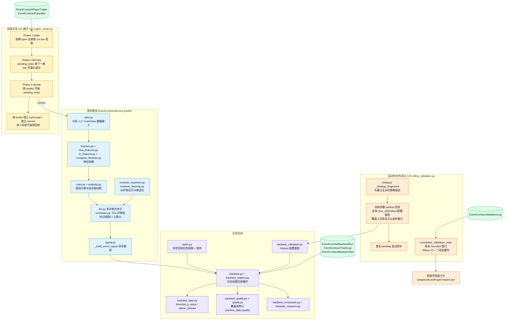

### 8.1 路由与前端接线

| 端点（前缀 `/api/event-contract`） | 用途 |
|---|---|
| `/symbols`、`/predict` | 可交易标的与单次预测 |
| `/backtest`、`/data-quality-preview` | 同步回测与数据质量预检（不抛错） |
| `/tasks`、`/tasks/latest`、`/tasks/{id}`、`/tasks/{id}/pause` | 异步回测任务编排 |
| `/{run_id}`、`/{run_id}/trades`、`/{run_id}/holdout` | 回测结果、逐笔日志、holdout 配置重放 |
| `/reviewers/stats` | 评审员进化快照 |
| `/paper-traders`（POST/GET）、`/paper-traders/{id}`（PUT enable）、`/{id}/bets`、`/{id}/stats` | 纸面交易员 CRUD/统计（`paper_trader_api.py`，含 `_break_even_win_rate`） |
| `/validation/{fingerprint}` | 滚动样本外验证进度（喂前端可信度卡片） |

前端侧：API 集中在 `lib/eventContractApi.ts`（约 900 行，前端最大 API 模块）；回测工具页 `components/backtest/BacktestTool.tsx`（Config/Results 面板）；归因分析页 `analytics/attribution-analysis/EventContractTab.tsx` 渲染 `EventPaperTraderCard`（本分支从 `portfolio/` **移动到** `analytics/`，其子组件 BetsTable/StatsSummary/TraderSelector 同步迁至 `analytics/event-paper-trader/`），同时该卡片也挂在 live 数据看板（`HyperliquidView` / `MobileDashboard` / `ComprehensiveView`）。

相关近期提交链：自动滚动验证（aa2f42f）→ 重复启动防护（7983ed5）→ 可信度卡片进度展示（eb50b70）→ 播种因子驱动反转信号池（7433ff4）与注册衰竭反转自定义因子（d531ca6，依赖 `custom_factors` 表与 `factor_expression_engine.py` 自定义表达式引擎）。

## 9. 数据模型 ER 概览

```mermaid
erDiagram
  USER ||--o{ ACCOUNT : owns
  USER ||--o{ USER_AUTH_SESSION : authenticates
  USER ||--o{ USER_EXCHANGE_CONFIG : selects_exchange
  USER ||--o{ COINGLASS_USER_KEY : stores_key

  ACCOUNT ||--o{ POSITION : has
  ACCOUNT ||--o{ ORDER : places
  ACCOUNT ||--o{ TRADE : records
  ACCOUNT ||--o{ AI_DECISION_LOG : produces
  ACCOUNT ||--o{ ACCOUNT_ASSET_SNAPSHOT : snapshots
  ACCOUNT ||--o{ ACCOUNT_PROMPT_BINDING : uses_prompt
  ACCOUNT ||--o{ ACCOUNT_PROGRAM_BINDING : runs_program
  ACCOUNT ||--o{ ACCOUNT_STRATEGY_CONFIG : configures_strategy

  PROMPT_TEMPLATE ||--o{ ACCOUNT_PROMPT_BINDING : bound_to
  PROMPT_TEMPLATE ||--o{ PROMPT_BACKTEST_TASK : tests
  PROMPT_BACKTEST_TASK ||--o{ PROMPT_BACKTEST_ITEM : has_items

  TRADING_PROGRAM ||--o{ ACCOUNT_PROGRAM_BINDING : bound_to
  TRADING_PROGRAM ||--o{ PROGRAM_EXECUTION_LOG : logs
  TRADING_PROGRAM ||--o{ BACKTEST_RESULT : backtests
  BACKTEST_RESULT ||--o{ BACKTEST_TRIGGER_LOG : explains

  SIGNAL_DEFINITION ||--o{ SIGNAL_POOL : included_in
  SIGNAL_POOL ||--o{ SIGNAL_TRIGGER_LOG : emits
  SIGNAL_POOL ||--o{ TRADER_TRIGGER_CONFIG : routes_to_trader

  CRYPTO_KLINE ||--o{ FACTOR_VALUE : input_to
  CUSTOM_FACTOR ||--o{ FACTOR_VALUE : computes
  FACTOR_VALUE ||--o{ FACTOR_EFFECTIVENESS : evaluated_by
  MARKET_TRADES_AGGREGATED ||--o{ SIGNAL_TRIGGER_LOG : can_trigger
  MARKET_ASSET_METRICS ||--o{ SIGNAL_TRIGGER_LOG : can_trigger
  MARKET_ORDERBOOK_SNAPSHOTS ||--o{ SIGNAL_TRIGGER_LOG : can_trigger

  HYPERLIQUID_WALLET ||--o{ HYPERLIQUID_ACCOUNT_SNAPSHOT : snapshots
  HYPERLIQUID_WALLET ||--o{ HYPERLIQUID_POSITION : positions
  HYPERLIQUID_WALLET ||--o{ HYPERLIQUID_EXCHANGE_ACTION : actions
  BINANCE_WALLET ||--o{ BINANCE_ACCOUNT_SNAPSHOT : snapshots
  HIBT_WALLET ||--o{ TRADE : manual_trades

  BINANCE_BACKFILL_TASK ||--o{ CRYPTO_KLINE : fills
  HIBT_BACKFILL_TASK ||--o{ CRYPTO_KLINE : fills
  HYPERLIQUID_BACKFILL_TASK ||--o{ CRYPTO_KLINE : fills

  HYPER_AI_PROFILE ||--o{ HYPER_AI_CONVERSATION : owns
  HYPER_AI_CONVERSATION ||--o{ HYPER_AI_MESSAGE : contains
  HYPER_AI_PROFILE ||--o{ HYPER_AI_MEMORY : remembers
  BOT_CONFIG ||--o{ BOT_CHAT_BINDING : binds

  EVENT_CONTRACT_BACKTEST_RUN ||--o{ EVENT_CONTRACT_TRADE_LOG : has
  EVENT_CONTRACT_BACKTEST_TASK ||--o{ EVENT_CONTRACT_BACKTEST_RUN : creates
  EVENT_CONTRACT_PAPER_TRADER ||--o{ EVENT_CONTRACT_PAPER_BET : places
  EVENT_CONTRACT_PAPER_TRADER ||--o{ EVENT_CONTRACT_VALIDATION_LOG : validates
```

> 注：`EventContractValidationLog` 实际按 `strategy_fingerprint`（`config.py` 生成的与窗口无关的配置哈希）与纸面交易员/回测运行关联，不是数据库外键；ER 图中的连线表达的是逻辑归属。

### 9.1 数据模型文件映射

| 模型文件 | 表/模型重点 |
|---|---|
| `accounts_auth.py` | `users`, `accounts`, auth sessions, subscriptions, user exchange config, CoinGlass user key |
| `trading.py` | `positions`, `orders`, `trades`, `ai_decision_logs`, account asset snapshots, strategy config |
| `market_data.py` | `crypto_klines`, price ticks, funding, samples, market flow aggregated tables, news articles |
| `hyperliquid.py` | Hyperliquid wallets, account snapshots, positions, exchange actions, backfill tasks |
| `binance.py` | Binance wallets, snapshots, backfill tasks |
| `hibt.py` | HiBT wallets, backfill tasks |
| `prompts.py` | Prompt templates, account bindings, prompt backtest tasks/items |
| `program_backtest.py` | Trading programs, account bindings, execution logs, backtest results/triggers |
| `signals.py` | Signal definitions, signal pools, trigger logs, trader trigger config |
| `factors.py` | Factor values, effectiveness, custom factors |
| `hyper_ai.py` | Hyper AI profile/memory/conversations/messages, bot configs/bindings |
| `ai_conversations.py` | Prompt/Signal/Attribution/Program AI conversation histories |
| `event_contract.py` | Event contract backtest runs/trades/tasks, paper trader/bets, validation logs |
| `system_config.py` | System config, trading config, sampling config, market regime config |

## 10. 启动与关闭流程

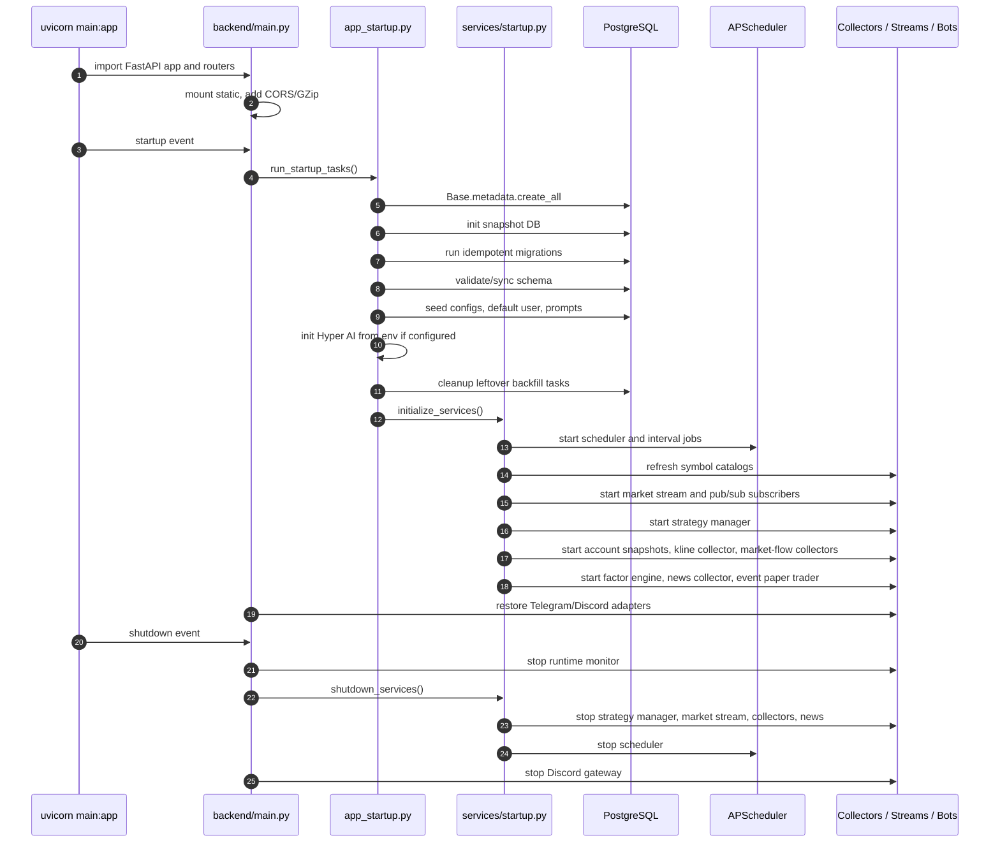

## 11. 开发、构建与运行部署图

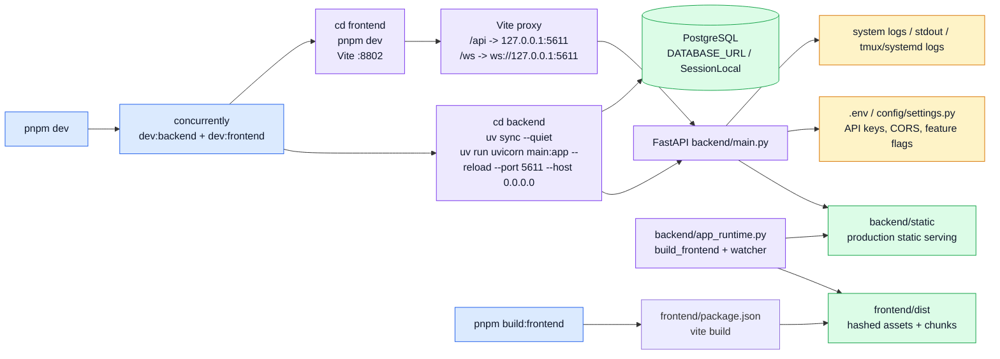

### 11.1 常用运行命令

| 场景 | 命令/路径 | 说明 |
|---|---|---|
| 安装 | `pnpm install:all` | 安装根依赖并 `uv sync` 后端依赖 |
| 开发启动 | `pnpm dev` | 同时启动 FastAPI `:5611` 与 Vite `:8802` |
| 仅前端 | `pnpm dev:frontend` | `cd frontend && pnpm dev` |
| 仅后端 | `pnpm dev:backend` | `cd backend && uv run uvicorn main:app --reload --port 5611 --host 0.0.0.0` |
| 前端构建 | `pnpm build:frontend` | Vite 构建到 `frontend/dist` |
| 生产静态 | `backend/static` | FastAPI 同源服务构建后的前端资源 |
| 后端测试 | `cd backend && uv run pytest` | pytest |
| 后端 lint | `cd backend && uv run ruff check .` | ruff |
| 数据覆盖验证 | `curl 'http://127.0.0.1:5611/api/system/data-coverage?...'` | 检查资金流/K线覆盖 API |

## 12. 从截图菜单到代码入口的映射

| 截图菜单 | hash page | 前端组件 | 主要后端 API/服务 |
|---|---|---|---|
| Hyper AI | `hyper-ai` | `components/hyper-ai/HyperAiPage` | `/api/hyper-ai/*`, `/api/ai-stream/*`, `services/hyper_ai_*` |
| 数据看板 | `comprehensive` | `portfolio/ComprehensiveView` 或 `hyperliquid/HyperliquidView` | `/api/account`, `/api/arena`, `/api/hyperliquid`, WebSocket |
| AI交易员 | `trader-management` | `trader/TraderManagement` | account/trader APIs, AI decision services |
| 提示词策略 | `prompt-management` | `prompt/PromptManager` | `/api/prompts/*`, prompt generation services |
| 程序化交易 | `program-trader` | `program/ProgramTrader` | `/api/programs`, `program_trader/*`, `program_execution_service` |
| 信号系统 | `signal-management` | `signal/SignalManager` | `/api/signals/*`, signal/factor/market flow services |
| 归因分析 | `attribution` | `analytics/AttributionAnalysis`（4 个 Tab：dimensions / trades / backtest / eventContract） | `/api/analytics`, `/api/prompt-backtest`, `/api/event-contract`, attribution AI services, `ai_decision_logs` |
| 回测工具 | `backtest-tool` | `backtest/BacktestTool` | `/api/event-contract`, `/api/prompt-backtest`, backtest services |
| 因子库 | `factor-library` | `factor/FactorLibrary` | `/api/factors/*`, factor computation/effectiveness services |
| 手动交易 | `manual-trading` | `hyperliquid/HyperliquidPage` | hyperliquid/binance/hibt trading clients |
| K线图表 | `klines` | `klines/KlinesView` | `/api/klines`, `crypto_klines`, kline collectors |
| CoinGlass | `coinglass` | `coinglass/CoinGlassView` | `/api/coinglass/*`, server-side CoinGlass client |
| 系统日志 | `system-logs` | `layout/SystemLogs` | `/api/system-logs` |
| 设置 | `settings` | `settings/SettingsPage` | `/api/system/*`, `/api/binance/*`, `/api/hibt/*`, `/api/news/*` |

## 13. 当前架构阅读建议

1. 如果要改 UI 骨架，优先看 `AppShell.tsx`、`Sidebar.tsx`、对应页面组件与 `frontend/app/lib/*Api.ts`。
2. 如果要改数据采集或覆盖率，优先看 `SettingsPage.tsx`、`ExchangeDataSettingsTab.tsx`、`DataCoverageHeatmap.tsx`、`api/system/*`、`services/exchanges/*backfill.py`、collector 和 `data_persistence.py`。
3. 如果要改 AI/策略链路，先确认 `paper/testnet/mainnet` 路由，再改 `services/ai_decision_service/*` 或 `services/trading_commands/*`。
4. 如果要改 DB，先看 `backend/database/models/*.py`、`migration_manager.py`、现有幂等迁移和启动 schema 校验。
5. 如果要上线生产静态资源，先 `pnpm build:frontend`，再确认 `backend/static` 的同步策略。
